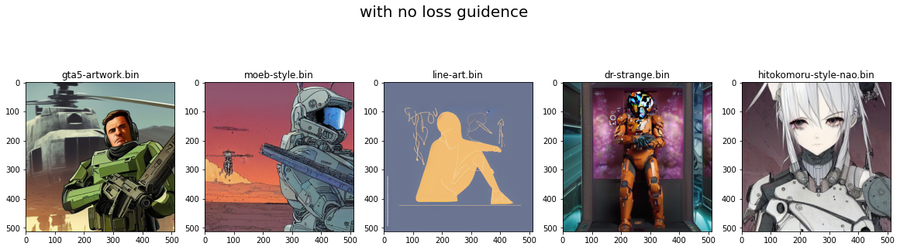
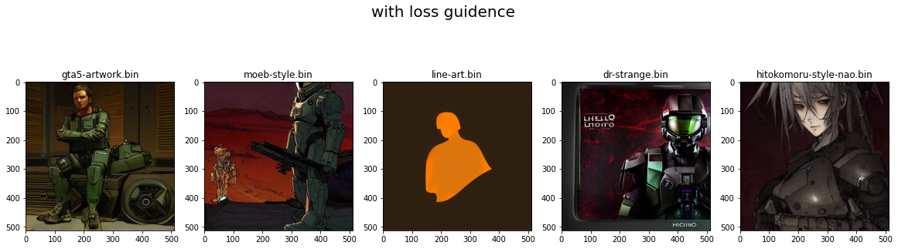

# EVA-8_Phase-1_Assignment-14
This is the assignment of 14th session in Phase-1 of EVA-8 from TSAI

## Introduction
This assignment mainly focus on Stable diffusion implementation using HuggingFace libraries. Below ar the two tasks under this assignment.

1. select 5 different styles of your choice and show output for the same prompt using these 5 different styles. Remember the seeds as you'll use them later. Keep seeds different for each 5 types.
2. now apply your own variant of "blue_loss" (it cannot be red, green or blue loss) on the same prompts with each concepts library and store the results. 

Post these 10 images on a blog, linkedin or any other social media (you do not need to mention TSAI any anything about this course). 

Share:
- the link to your post
- share the GitHub link where I can find your colab file and creative loss details.

### About Stable Diffusion
Stable Diffusion is a generative model that uses diffusion processes to learn a probability distribution over a dataset. It  is designed to generate high-quality samples by iteratively diffusing a noise vector through a series of learned transformations. The model is trained by maximizing the likelihood of the data under the diffusion process. Stable Diffusion has been shown to produce state-of-the-art results in a variety of image synthesis tasks, such as image completion, super-resolution, and style transfer.

## Image generation using Textual inversion only

### About Textual inversion
In the text-encoding stage of most text-to-image models, the first stage involves converting the prompt into a numerical representation. This is typically done by converting the words into tokens, each equivalent to an entry in the model's dictionary. These entries are then converted into an "embedding" - a continuous vector representation for the specific token. These embeddings are usually learned as part of the training process. In our work, we find new embeddings that represent specific, user-provided visual concepts. These embeddings are then linked to new pseudo-words, which can be incorporated into new sentences like any other word. In a sense, we are performing inversion into the text-embedding space of the frozen model. We're calling the process 'Textual Inversion'. [reference link](https://textual-inversion.github.io/)

### models used for Textual Inversion
There are multiple such models available which are trained with custom embedding and two-three images of visual concept. Here is the library of all such models available in HuggingFace site - [link](https://huggingface.co/sd-concepts-library)

Five models which I used in this repo are:
1. gta5-artwork.bin
2. moeb-style.bin
3. line-art.bin
4. dr-strange.bin
5. hitokomoru-style-nao.bin

### Generated image from above models


## Image generation using Textual inversion and loss guidance
### About loss guidance
Loss guidence is a techique to guide or control image generation while de-noising using UNET in stable diffusion. In this techique we modify/hack the loss function of de-noising UNET and force it to generate a certain type of image depending on the implemented loss function.

Hence in each step of de-noising i.e. 30 or 50 this loss function will guide the image generation over each step.

### Canny loss calculation
In this assignment, I have implemented Canny loss function in which I am taking output of decoder and calculating mean of square of differences between Canny version of image and original output.

Below is the implementation code for loss function which uses OpenCV to calculate Canny image and then convert it to RGB and then again calculate the loss.

```
def forward(self, output_image):
        # Apply Canny edge detection to the output image
        canny_image = torch.zeros_like(output_image)

        output_np = output_image.detach().cpu().squeeze().numpy()

        output_np = np.transpose(output_np, (1, 2, 0))

        canny_np = cv2.Canny(output_np.astype('uint8'), 100, 200)

        canny_np = np.stack((canny_np,)*3, axis=-1)
        canny_np = np.transpose(canny_np, (2, 0, 1))

        canny_tensor = torch.from_numpy(canny_np).float() / 255.0
        canny_image = canny_tensor.unsqueeze(0)

        # Create target by detaching the canny image
        target = canny_image.detach().to(output_image.device)

        # Compute the mean squared error between the output and target
        loss = torch.mean((output_image - target) ** 2)

        return loss
```
### Generated image from loss guidance
